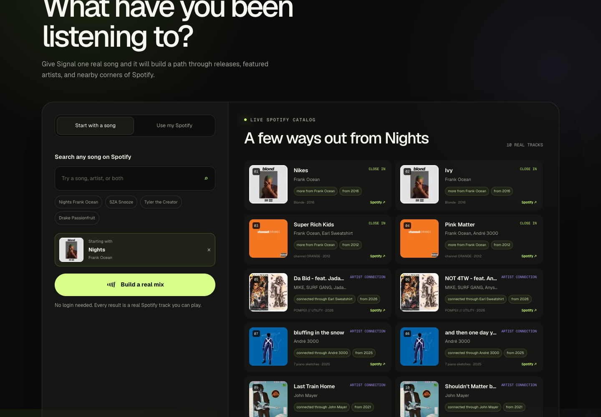

# Signal

Signal helps you get from one song you love to music worth playing next.

[Try the live app](https://signal-recommender.vercel.app) ·
[Read the case study](https://rohansingh04.com/projects/spotify-recommender)

## What it does

- Searches Spotify's real catalog without requiring a login
- Builds a mix from the seed artist's releases and real collaborators
- Shows real artwork, album details, release dates, and Spotify links
- Explains the artist or release connection behind every pick
- Lets invited listeners connect Spotify for mixes based on artists they already play

There is no made-up match percentage here. Signal uses relationships the current
Spotify API can actually support and tells you why each song made the list.

## How the recommendations work

Signal starts with a song, walks through its artists' albums and singles, then
follows recurring collaborators into their catalogs. The ranking removes
duplicates, penalizes low-value versions, and caps how much one artist or album
can take over the mix.

Account-based mixes rotate between favorite artists, their catalogs, and their
collaborators. Recent recommendations stay in browser-local history so a refresh
can favor songs you have not just seen. If the available catalog is exhausted,
the app says so clearly and starts a fresh rotation.

## Architecture

~~~text
Browser
  |-- public song search
  |-- optional Spotify OAuth
  |-- recent recommendation history
  |
  v
Next.js + TypeScript
  |-- server-held Spotify credentials
  |-- encrypted account sessions
  |-- catalog and collaborator discovery
  |-- ranking, deduping, and variety rules
  |
  v
Spotify Web API
~~~

Spotify credentials stay on the server. OAuth state is checked on callback,
expired access tokens can refresh, and public endpoints have basic rate limits.
The browser only receives the track details it needs.

## Run the web app

~~~bash
cd web
npm install
cp .env.example .env.local
npm run dev
~~~

See [the web setup guide](web/README.md) for Spotify callback URLs, environment
variables, and Vercel deployment. Run the full web check with:

~~~bash
cd web
npm run check
~~~

Spotify limits development-mode apps to invited accounts. Public song search
and song-based mixes still work for everyone; login is an optional deeper path.

## Where it started

The repository also keeps the original Python audio-feature recommender. It
normalizes a mood or seed profile, ranks a deterministic candidate set by
weighted distance, and explains the closest dimensions.

Its 72-track fixture is only for repeatable tests. It is not the catalog behind
the live product.

~~~bash
python -m venv .venv
source .venv/bin/activate
pip install -r requirements-dev.txt
pytest -q
ruff check .
python evaluate.py --json
~~~

The Python prototype shows where the idea began. The Spotify-backed TypeScript
app is the current product.
